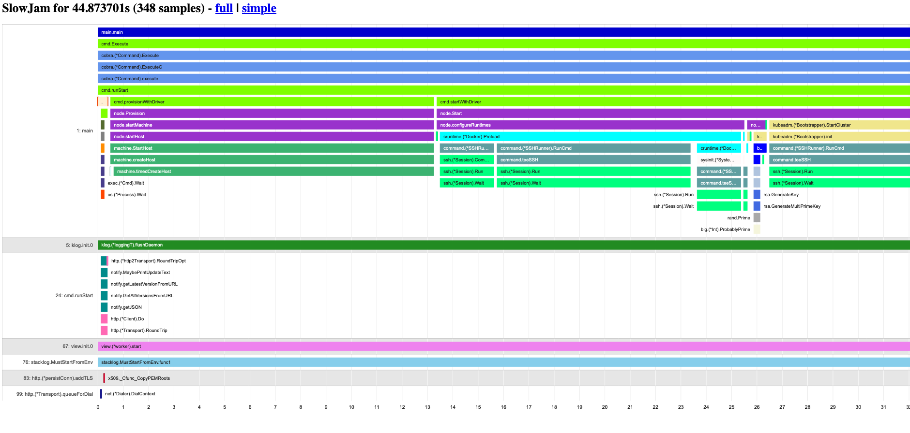

# 

`NOTE: This is not an officially supported Google product`

SlowJam is a two-part tool for analyzing function latency within Go programs.

* `stacklog` - a library for sampling the stack of a Go program during runtime
* `slowjam` - a binary for visualizing the latency from recorded stack samples

SlowJam excels at finding optimization opportunities in automation workflows, as they tend to block on command-line execution or remote resources, rather than CPU resources. This tool was created from a hackathon hosted by Google's Container DevEx  team, with the goal of finding ways to reduce the start-up latency within [minikube](http://minikube.sigs.k8s.io/).

## Features

* Hybrid Gantt/Flamegraph visualizations
* Automated sampling of all function calls
* Trivial to integrate
* Zero overhead when inactive, <1% overhead when activated

## Screenshot



See [example/minikube.html](example/minikube.html) for example output.

## Requirements

* Go v1.14 or higher

## Usage

### Recording

Add this to the `main()` method of your program, or within any other function you wish to record stack samples for:


```go
s := stacklog.MustStartFromEnv("STACKLOG_PATH")
defer s.Stop()
```

This will invoke the stack sampler if the `STACKLOG_PATH` environment is set, and will write the stack samples to that location. If you prefer greater control over the configuration, you can also use:

```go
cfg := stacklog.Config{
  Path: "out.slog",
  Poll: 100 * time.Millisecond,
	Quiet: true
}
  
s, err := stacklog.Start(cfg)
defer s.Stop()
```

By default, this will poll the stack every 125ms.

## Visualization

Install slowjam:

`go get github.com/google/slowjam/cmd/slowjam`

Analyze a stacklog using the interactive webserver:

```shell
slowjam --http localhost:8080 /path/to/stack.slog
```

To output a Gantt/Flamegraph chart to `out.html`:

```shell
slowjam --html out.html /path/to/stack.slog
```

To output a text summary to `out.txt`:

```shell
slowjam --html out.txt /path/to/stack.slog
```

## Real World Examples

1. Integrating SlowJam with Go binary.

Here's an example PR to integrate SlowJam analysis into minikube: [minikube#8329](https://github.com/kubernetes/minikube/pull/8329). 

With this PR, anyone can generate a slowjam profile:

`env STACKLOG_PATH=minikube.slog minikube start`

You can then convert the data to various forms, as per the examples/ directory:

`slowjam --goroutines 1 --pprof example/minikube.pprof example/minikube.slog`
`slowjam --html example/minikube.html example/minikube.slog`

What minikube contributors discovered with these results were:

* Functions which could obviously be run in parallel were executed in serial.
* Functions which we expected to be fast (<1s) were slow (10s). In many cases we were able to remove or rewrite these functions to do less work.

The net result was a 2.5X reduction in start-up latency: from ~66 seconds to ~26 seconds.

2. Analyzing an integrated Go binary in kubernetes cluster. 

Here's an pod config to analyze a Go binary running on a kuberenets cluster: [Pod SlowJam Profile](https://github.com/GoogleContainerTools/kaniko/blob/master/examples/pod-build-profile.yaml)

In this Pod Config, 
1. Set the environment variable `STACKLOG_PATH` to  to generate slowjam profile.
2. Copy the generated stack samples to a accessible location in [Container Lifecyle hooks](https://kubernetes.io/docs/tasks/configure-pod-container/attach-handler-lifecycle-event/#define-poststart-and-prestop-handlers) `pre-stop`.


